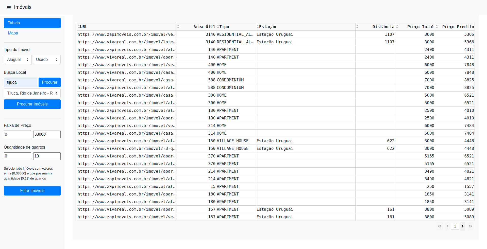
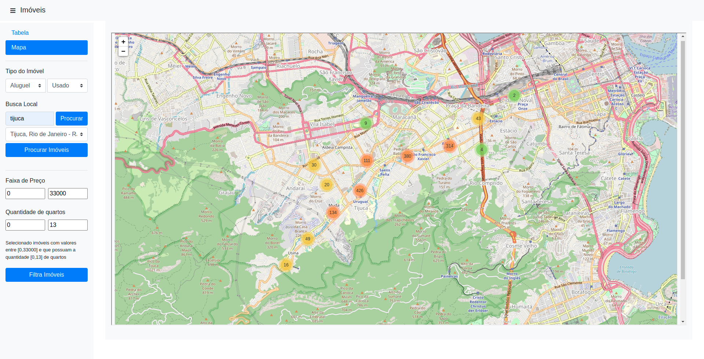

# 1. Get Listings

Esse app tem como objetivo capturar dados do ZapImoveis e Vivareal, adicionando a possibilidade da visualização em mapa, um modelo de precificação para identificar os imóveis com melhor custo/benefício e a distância da estação de metro/trem mais próxima.





## 1.1. Configuração

Para configurar usuário, senha, database do banco de dados, basta modificar o arquivo `.env`;
Para configurar a extração, basta modificar o arquivo `settings.toml`.

## 1.2. Execução

```sh
git clone https://github.com/dobraga/get_listings
cd get_listings
```

Na primeira execução é necessário executar:
```sh
make init_db
```

```sh
docker-compose -f "docker-compose.yml" up --build
```


## 1.3. Desenvolvimento

1. Alterar a variável `FLASK_ENV` no arquivo `.env` para "development"
2. Subir banco de dados: `make db`
3. Caso seja a primeira execução executar `make init-db`
4. Subir Dash localmente: `make dash`
